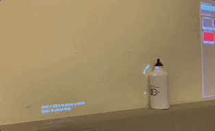

# Bezier-Spline-Runtime-Editor 

NOTE: This is a very early demo, I have since completed and integrated the tool into Tetra to include meshing, shaders, and fully functional projection mapping. 

This is a tool that I have created that allows you to create and edit cubic or quadtratic Bezier curves at runtime in Unity. It uses a LineRenderer and draws several conjoined Bezier segments upon mouse click. It gives you two (cubic), or one (quadtratic), control points.  I have generated these by considering the two end points of a segment to make up an equaliatiral triangle, of which the two control points are the third vertex. You can drag around these around to alter the corresponding Bezier segment. Currently, the choice of segments to be cubic or quadratic is determined by the boolean variable "cubic". In the future, I may add the ability to decide between these as as an editor feature. 

## Screenshots
### Drawing a heart using cubic Beziers: [(Try it)](https://shahd-s.itch.io/cubic-bezier?secret=DXiD7H3UWCVitXrf7OkeXqrbEuo)

### Quadtratic: [(Try it)](https://shahd-s.itch.io/quadratic-bezier?secret=cAcBfijaPJ3aJ0zcAm9QViNgMLM)

